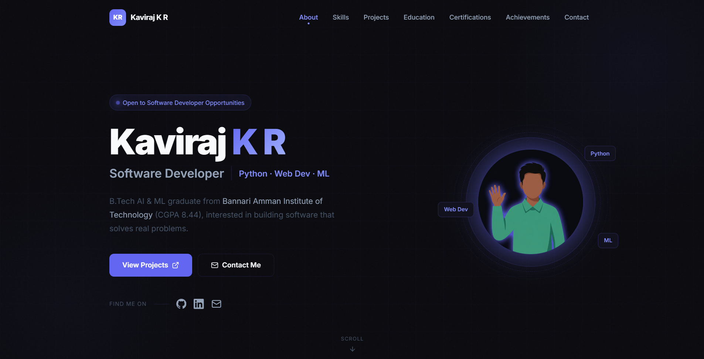
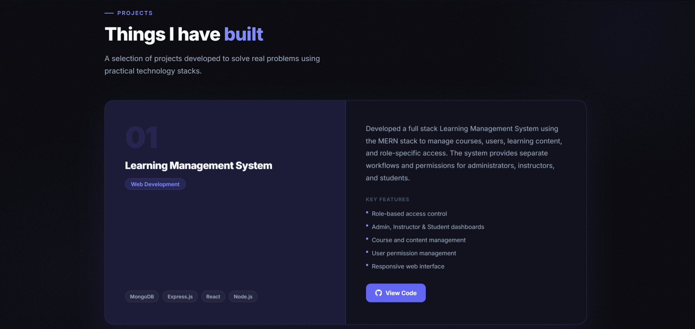

# Kaviraj K R — Personal Portfolio

Welcome to my personal portfolio repository.

This website is a place where I showcase my journey, skills, projects, and interests in software development, web development, and machine learning.

🌐 **Live Portfolio:** [kaviraj-portfolio.vercel.app](https://kaviraj-portfolio.vercel.app/)

---

## 👨‍💻 About Me

Hi, I'm **Kaviraj KR**, a B.Tech graduate in Artificial Intelligence and Machine Learning.

I enjoy building practical applications, exploring new technologies, and turning ideas into useful projects. I'm particularly interested in software development, web development, Python, and machine learning.

I'm always learning, experimenting, and looking for opportunities to improve my technical and problem-solving skills.

---

## 📸 Portfolio Preview

### 🏠 Homepage

### 🚀 Projects

🌐 **View the live portfolio:**
[kaviraj-portfolio.vercel.app](https://kaviraj-portfolio.vercel.app/)

---

## 🚀 What I Build

I enjoy working on projects that combine **software development and practical problem-solving**.

Some of my projects include:

* **Learning Management System** — A role-based learning platform with coding practice and personalized learning features.
* **Diabetes Prediction** — A machine learning project for predicting diabetes using classification algorithms.

More projects are available on my portfolio and GitHub.

---

## 🎯 Currently

* Improving my software development skills
* Building practical projects
* Exploring new technologies
* Learning and strengthening my problem-solving skills

---

## 🔗 Connect With Me

* 🌐 **Portfolio:** [kaviraj-portfolio.vercel.app](https://kaviraj-portfolio.vercel.app/)
* 💼 **LinkedIn:** [Kaviraj KR](https://www.linkedin.com/in/kaviraj18)
* 🐙 **GitHub:** [kaviraj-1718](https://github.com/kaviraj-1718)

---

⭐ Thanks for visiting my repository!
